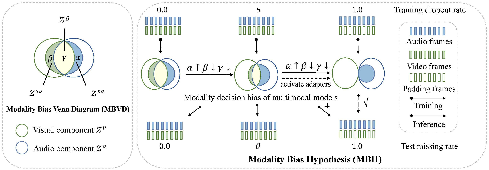
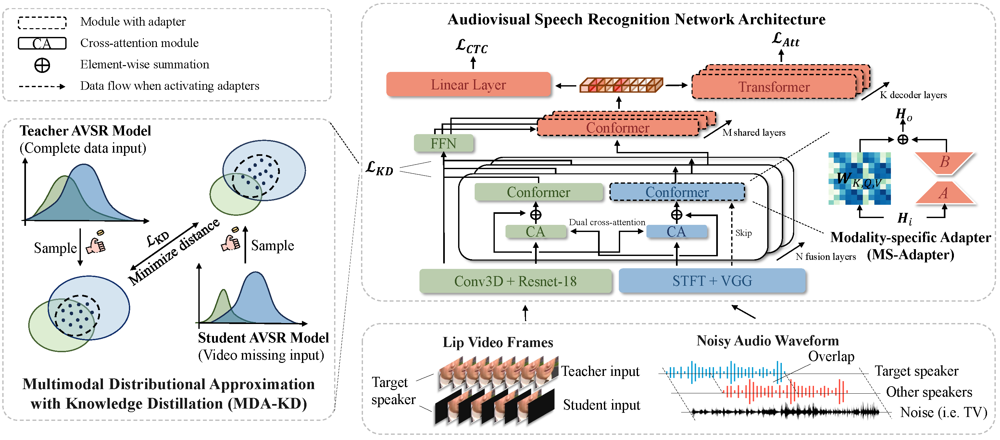

# [CVPR 2024] A Study of Dropout-Induced Modality Bias on Robustness to Missing Video

Offical implementation of the CVPR 2024 paper: A Study of Dropout-Induced Modality Bias on Robustness to Missing Video.


## To-Do:

- Paper update on arxiv (Before Camera Ready)
- Pretraining Code (Before Conference)
- MDA-KD finetune Code (Before Conference)
- MS-Adpter finetune Code (Before Conference)
- Environment Setting  (Before Conference)
- Inference Code (Before Conference)

## News

- (🔥New) 2024/03/06 The project page is  uploaded on the Github.

## Brief Intro

### Abstract

Advanced Audio-Visual Speech Recognition (AVSR) systems have been observed to be sensitive to missing video frames, performing even worse than single-modality models. While applying the dropout technique to the video modality enhances robustness to missing frames, it simultaneously results in a performance loss when dealing with complete data input. In this paper, we investigate this contrasting phenomenon from the perspective of modality bias and reveal that an excessive modality bias on the audio caused by dropout is the underlying reason. Moreover, we present the Modality Bias Hypothesis (MBH) to systematically describe the relationship between modality bias and robustness against missing modality in multimodal systems. Building on these findings, we propose a novel Multimodal Distribution Approximation with Knowledge Distillation (MDA-KD) framework to reduce over-reliance on the audio modality and to maintain performance and robustness simultaneously. Finally, to address an entirely missing modality, we adopt adapters to dynamically switch decision strategies. The effectiveness of our proposed approach is evaluated and validated through a series of comprehensive experiments using the MISP2021 and MISP2022 datasets.

### Dropout-Induced Modality Bias

Through the aforementioned three experiments, we have discovered that increasing the training dropout rate on video data leads to increased similarity between AVSR and ASR in the performance degradation curves, recognition results, and intermediate representation subspace distribution. The findings reveal the significant impact of dropout in introducing effectively perturbs the distribution of multimodal training data. It leads to a shift from multimodal joint distribution to unimodal distribution, resulting in a decision bias towards audio during the decision-making process, as reflected in the output similarity of ASR. We refer to this phenomenon induced by dropout as dropout-induced modality bias. Although dropout-induced bias enhances the robustness of missing video data to some extent, we emphasize that it contradicts the primary design of AVSR as a robust application in noisy environments with supplementary visual cues.

<p align="center">
    
</p>

### Modality Bias Hypothesis (MBH)

We propose the Modality Bias Hypothesis (MBH)  based on the Modality Bias Venn diagram (MBVD) to systematically describe the relationship between modality bias and robustness to missing modality. MBVD is a variant of the [Modality Venn Diagram (MVD)](https://arxiv.org/abs/2206.06487) employed in multimodal knowledge distillation and more discussion between these two concept model could be found in Appendix.

<p align="center">
    
</p>

### **Distributional Approximaition with Knowledge Distillation (MDA-KD)**

For the robustness training of modality-bias systems, it is crucial to avoid dropout-induced modality bias on the primary modality. Dropout indeed alleviates the OOD problem to some extent but encourages multimodal models to pursue trivial solutions at the same time. Ideal robust multimodal models are expected to achieve two goals: (1) learn to extract mutual information across modalities rather than relying on a certain modality when facing complete paired input, and (2) learn to complement information from the other modality and utilize context information from adjacent frames. To prevent excessive modality bias caused by dropouts, we propose a novel Multimodal Distribution Approximation with Knowledge Distillation (MDA-KD) framework to constrain the distribution of the multimodal feature space during the robustness training phase.

<p align="center">
    
</p>

### Modality-specific Adapter (MS-Adapter)

For entirely missing modalities, adapters are adopted to dynamically switch decision bias to the specific modality. By activating the MS-Adapter, we can dynamically switch the decision-making pattern by activating the adapters. We highlight two advantages of the MS-Adapter. First, a substantial amount of unpaired unimodal training data and data augmentation techniques could be used in the training process of the adapters. Second, the adapter training process provides an opportunity to modify the computation pathway. As illustrated in Figure with dashed arrows, in both training and inference stage with audio-only input, the computation flow of the video branch will be directly cut off, and the modality fusion cross-attention module will be skipped to reduce computational costs.

## Experiment Results

#### Maintain performance and robustness simultaneously


#### **The advantage of robustness against zero-shot noise of our proposed modality-unbiased model is highlighted, aligning with the objective of AVSR as a robust system for real-world applications**


## BibTeX

If you find our work intriguing, inspiring or useful to your research, please consider citing:

```bibtex

```

